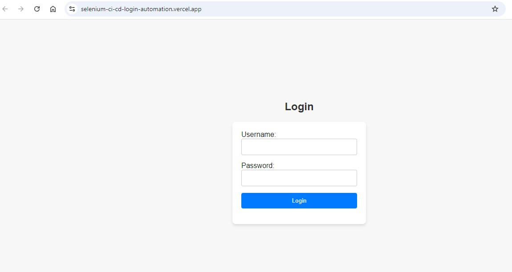
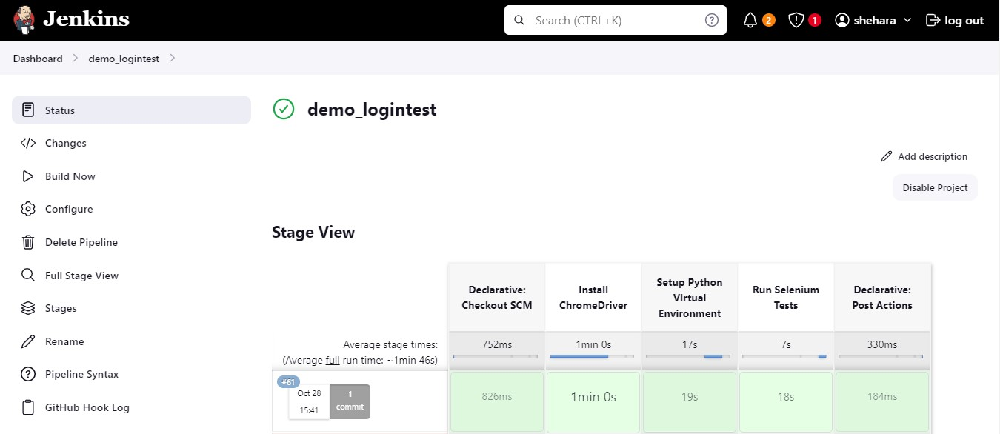

# Jenkins CI/CD Pipeline with GitHub Webhooks

This simple, self studying project demonstrates a simple CI/CD pipeline using Jenkins and GitHub webhooks. 
The pipeline is triggered automatically whenever a change is pushed to the GitHub repository,
 allowing for continuous integration and deployment.

## Prerequisites

- Jenkins server: set up Jenkins on a server.
- GitHub repository: publish the application and test scripts in GitHub repository.
- Vercile account: deploy the the NextJS app on serveless Vercile host service.

## Simple Login Application
The application used in this project is a simple login system built to demonstrate basic authentication functionality.
 It consists of a user interface where users can input their credentials (username and password).

 

 ## Features
 - Login Validation: The app checks for valid user inputs and returns appropriate success or error messages based on login success or failure.
 - Input Error Handling: The app provides feedback for invalid inputs, such as empty fields or incorrect credentials.

 ## Techniques 

- Jenkins: Jenkins serves as the core of the CI/CD pipeline, handling build automation, testing, and orchestrating various stages of the development lifecycle. Every time new  code is pushed to GitHub, Jenkins automatically runs the pipeline, ensuring continuous integration.
- GitHub Webhooks: Webhooks trigger the Jenkins build whenever changes are made to the repository, initiating the CI/CD process immediately upon each commit, ensuring smooth collaboration and rapid testing.
- Pipeline Script: A Jenkinsfile is used to define each stage of the pipeline, which includes:
        -- Checkout: Pulls the latest code from the GitHub repository.
        -- Build: Installs dependencies and prepares the code.
        -- Testing: Runs automated tests (using Selenium) to verify functionality.
        -- Deployment: (not implemented yet), the pipeline is structured for future deployment to staging or production environments.
- Automated Testing with Selenium: The pipeline integrates Selenium-based automated tests to validate UI functionality. Tests are triggered automatically as part of the pipeline, reducing manual testing efforts and catching issues early in the development process.
- Continuous Deployment (CD): While currently under development, this stage will eventually automate the deployment of validated code to Vercel or other environments, making the release process faster and more reliable.

## Future Improvements

- Full Continuous Deployment: Implement automatic deployment to production after successful testing.
- Expanded Test Coverage: Increase the range and depth of automated tests to improve reliability
- Notification System: Set up notifications for build status, alerts, or deployment results.
